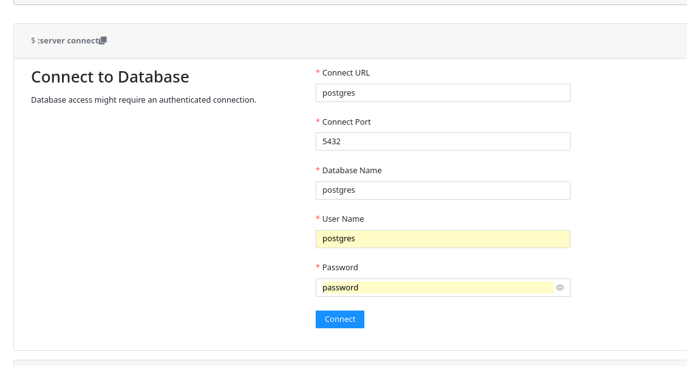
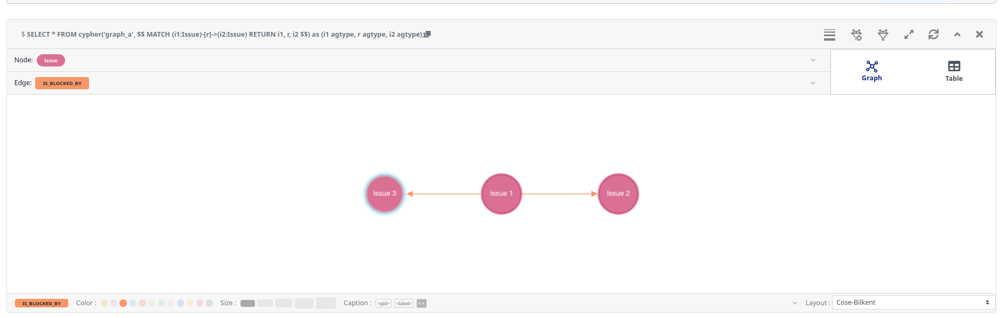

# Apache Age playground

I created this playground to experiment for the first time how to use [Apache Age](https://age.apache.org/).

See also my <https://github.com/stephane-klein/neo4j-playground>.

```sh
$ docker compose up -d --wait
$ ./scripts/enter-in-pg.sh
postgres=# \dx
                 List of installed extensions
  Name   | Version |   Schema   |         Description
---------+---------+------------+------------------------------
 age     | 1.5.0   | ag_catalog | AGE database extension
 plpgsql | 1.0     | pg_catalog | PL/pgSQL procedural language
```

```sh
$ ./scripts/enter-in-pg.sh -f playground.sql
Create some vertices, some Issues;
                                             issues
-------------------------------------------------------------------------------------------------
 {"id": 844424930131969, "label": "Issue", "properties": {"iid": 1, "title": "Issue 1"}}::vertex
 {"id": 844424930131970, "label": "Issue", "properties": {"iid": 2, "title": "Issue 2"}}::vertex
 {"id": 844424930131971, "label": "Issue", "properties": {"iid": 3, "title": "Issue 3"}}::vertex
(3 lignes)
```

## Age Viewer

```sh
$ firefox http://localhost:3000/
```



```sql
SELECT *
FROM cypher('graph_a', $$
    MATCH (i1:Issue)-[r]->(i2:Issue)
    RETURN i1, r, i2
$$) as (i1 agtype, r agtype, i2 agtype);
```


